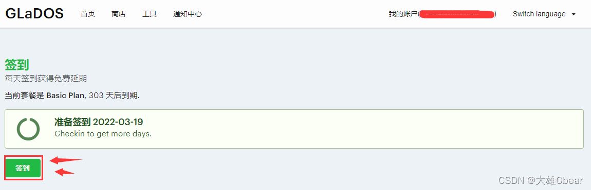
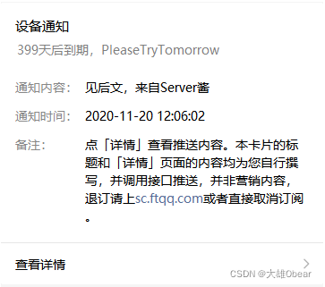
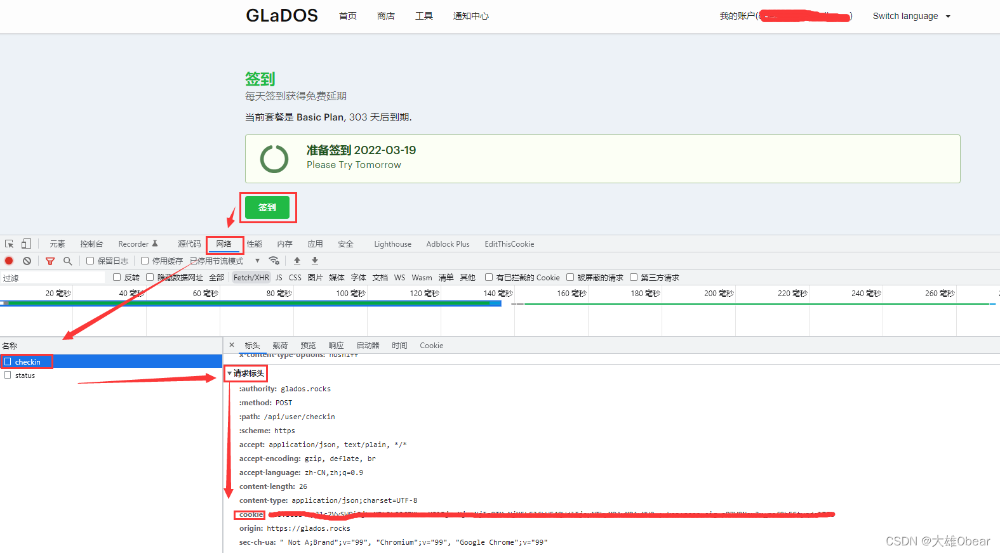
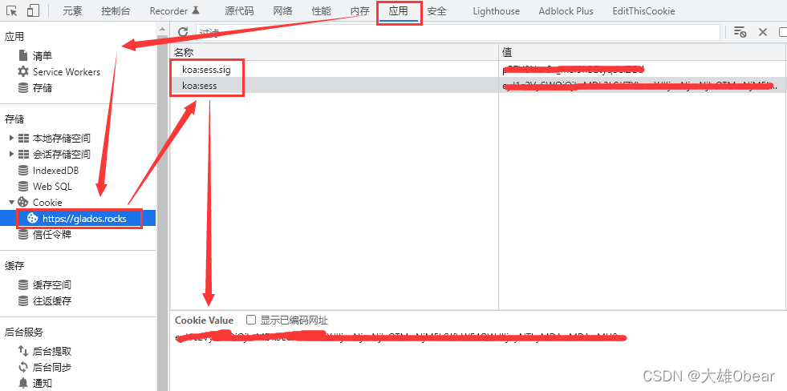
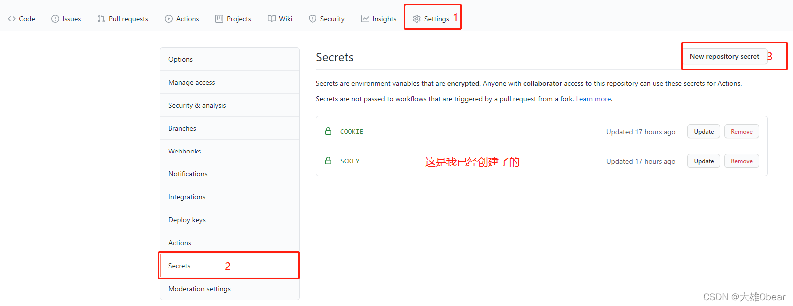
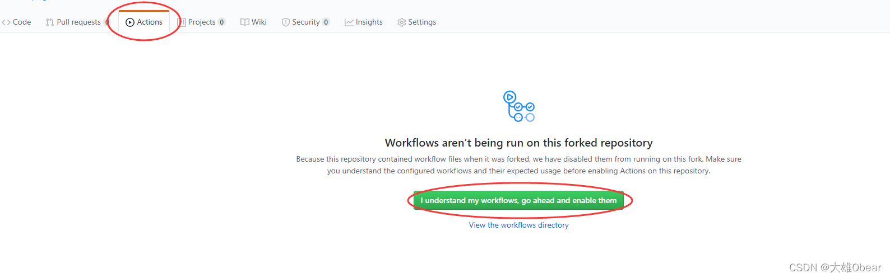
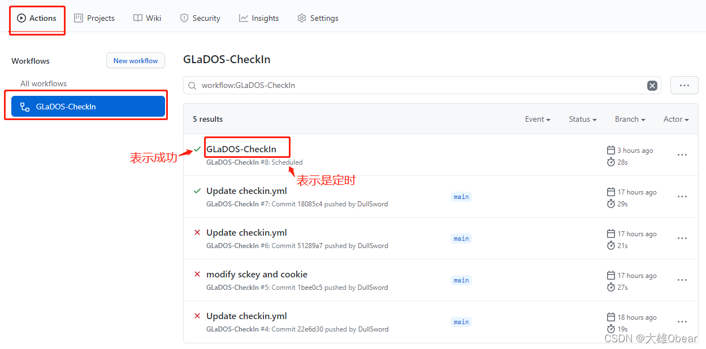
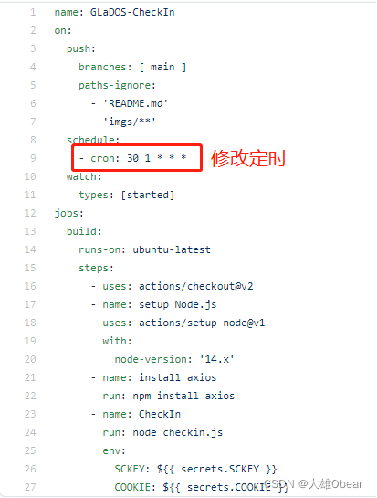

> GLaDOS是什么？ GLaDOS，隶属于GLaDOS Network，是一家专业的V2Ray/Trojan机场，超过4年的老品牌，官方网站使用自主开发的管理系统，属于技术派的老站，而且流量套餐性价比非常高。GLaDOS加速器在全球4个地区（台湾、香港、日本、美国）的6个数据中心，部署大量优质节点线路，并采用负载均衡技术，会根据用户当地的网络情况自动分配最快的节点进行加速访问，以保障用户可随时快速访问任何地区的网站。现在，GLaDOS已经增加了Trojan节点线路(节点名称为N2)，相较于 VMess 协议的V2Ray节点，其网络连接速度会显著提升，但暂时仅支持 Shadowrocket 和 Clash 系列客户端软件，用户使用体验反馈非常好！

Galdos 官网：https://glados.rocks/



这里并不是要给大家推荐这个产品，只是本人自己用到了，官网每天可以签到，有时候会赠送1天，然后这里实现了自动签到续费，觉得还可以所以分享一波。

如果你对这个产品感兴趣可自己看看：https://iyideng.vip/special/bgfw/glados-v2ray-wireguard.html

实现自动有两种方法，这里给大家介绍使用的 GitHub 方法。

### 获取代码

代码仓库：https://github.com/obear997/GLaDOS-CheckIn

### 基本功能

- 基于Github Action
- 每天北京时间9点30分（UTC时间1点30分）进行自动签到
- 实际上通常会延迟，但不会太久，庆幸的是大多情况下我们并不关心是否准时
- 可用server酱通过公众号推送结果



### serve酱的sckey（不需要可以跳过）

> 什么是serve酱？ 「Server酱」，英文名「ServerChan」，是一款「手机」和「服务器」、「智能设备」之间的通信软件。 说人话？就是从服务器、路由器等设备上推消息到手机的工具。

serve酱官网：https://sct.ftqq.com/


### 获取GlaDOS Cookie

打开“开发者工具”，通常快捷键为F12，或是点击浏览器选项-更多工具-开发者工具，打开后如图所示点击 “网络” （未进行汉化的话是：network）标签

#### 获取方法1：

在签到页面点击 “签到”，相对应的开发者工具 “网络” （未进行汉化的话是：network）标签下会出现“checkin” 请求，点击该请求，会出现更多信息，找到 请求头（Request Headers）里的“cookie”，接下来设置密钥时需要用到



#### 获取方法2：

GLaDOS 的 Cookie 组成格式为

```
cookie: koa:sess=xxxxxxxxx; koa:sess.sig=xxxxxxxx
```

在开发者工具中，找到 “应用” 在Cookie 中可看到 `koa:sess` 和 `koa:sess.sig` ，按照上面格式自己拼接起来即可。



### Fork此仓库

**注意**：接下来的步骤都是在你自己fork后的仓库下进行操作


### 设置密钥

按照下面步骤，设置2个密钥

- `SCKEY` ： serve酱的sckey（不需要可以不创建或不设置）
- `COOKIE` ： 账号的cookie（第一步准备工作中所找到的cookie）



### 启用Action

点击 “Actions”，再点击 “I understand my workflows, go ahead and enable them”



点击仓库（你自己的）右上角的 “Star⭐” 或修改除imgs文件夹和 “README.md” 以外的内容并进行 “Push”

### 查看运行结果




在GitHub 能看到执行记录，并且微信也收到了 serve酱的 推送的消息，说明自动签到已部署成功。

### 修改执行时间

打开 `.github/workflows/checkin.yml` ，修改 `crontab` 表达式



时间规则为：`秒 分 时 天 月 周`，如：`30 1 * * *` ，意思是`每天01:30`执行该脚本。