> 什么是青龙面板 青龙面板支持python3、javaScript、shell、typescript 的定时任务管理面板（A timed task management panel that supports typescript, javaScript, python3, and shell.）

### 修改脚本

> 什么是serve酱？ 「Server酱」，英文名「ServerChan」，是一款「手机」和「服务器」、「智能设备」之间的通信软件。 说人话？就是从服务器、路由器等设备上推消息到手机的工具。

在 `sckey` 和 `cookie` 后面填写 serve酱的 `sckey`（不需要可以跳过）和 账号 `cookie`

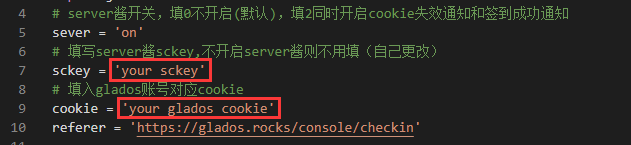

#### 获取serve酱的 `sckey`

serve酱官网：https://sct.ftqq.com/

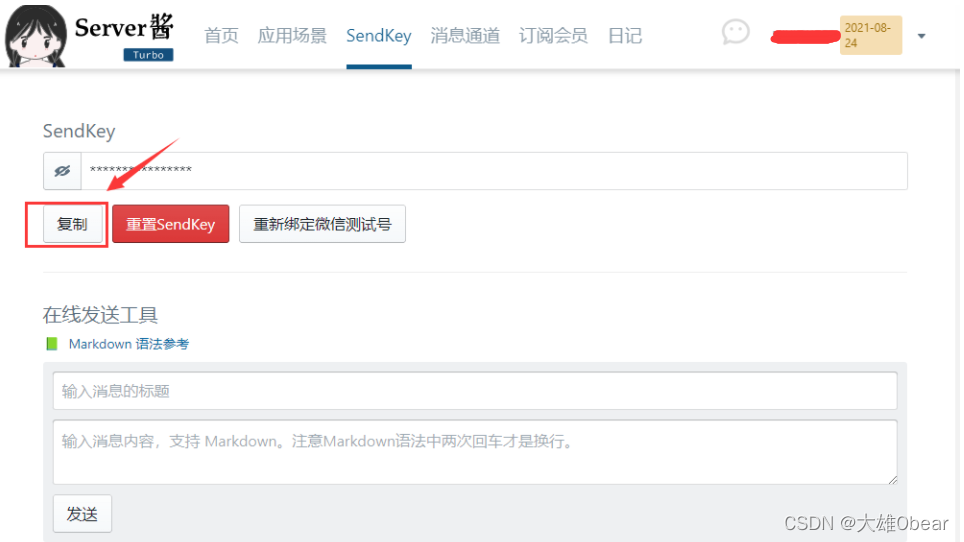

#### 获取账号 `cookie`

打开“开发者工具”，通常快捷键为F12，或是点击浏览器选项-更多工具-开发者工具，打开后如图所示点击 “网络” （未进行汉化的话是：network）标签

### 上传脚本

#### 方法1：直接上传脚本

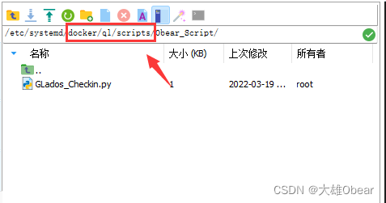

可通过 `ftp` 工具直接找到青龙面板安装位置，在 `scripts` 目录中新增自己的目录，所以直接把签到脚本文件放根目录也可以。

青龙面板可能会根据你所使用的命令存放目录，所以每个人都不一样，我的 `docker` 安装目录为：`/etc/systemd/docker/` ，而青龙面板则存放在 `docker` 的子目录中。

#### 方法2：新建脚本

在青龙面板中找到 “脚本管理”

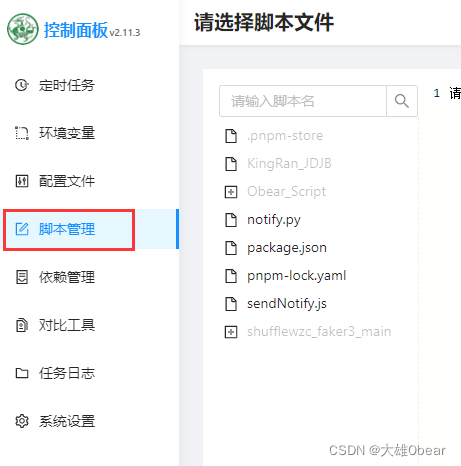

从面板右侧点击 ”+“ 按钮

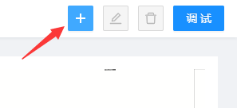

根据自己的实际情况填写脚本信息，用到的是 `Python` 所以，文件最后是 `.py`

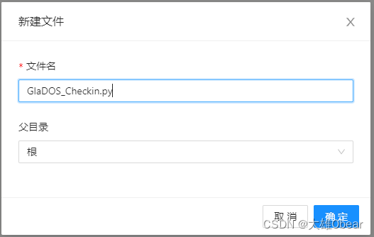

### 添加签到任务

在青龙面板中找到定时任务

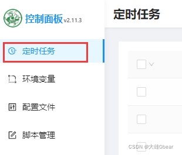

从面板右侧点击 ”新建任务“

按照上面创建的文件的名称和路径设置任务命令

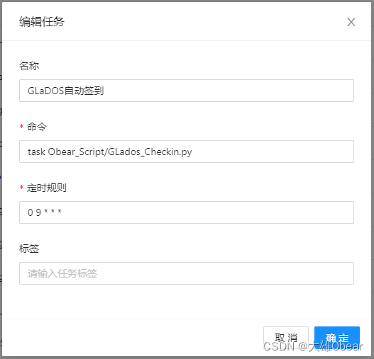

时间规则为：`秒 分 时 天 月 周`，如：`0 9 * * *` ，意思是`每天09:00`执行该脚本。

### 测试效果

点击任务后面的 ”运行“ 按钮进行手动执行一次

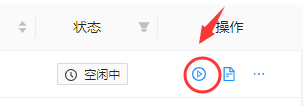

点击任务后面的 ”日志“ 按钮查看运行日志

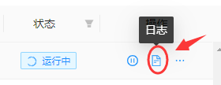

见到下面日志，说明成功签到，并且获得了1天奖励时间。

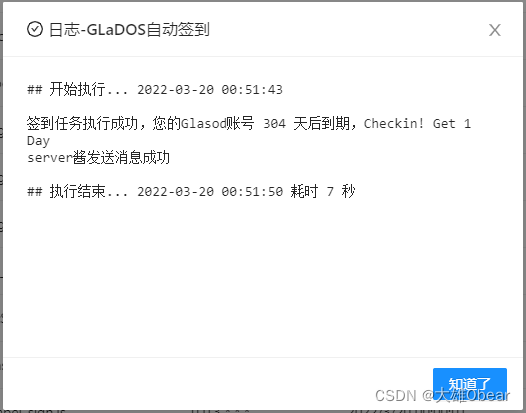

到此，GLaDOS自动签到就部署成功了。